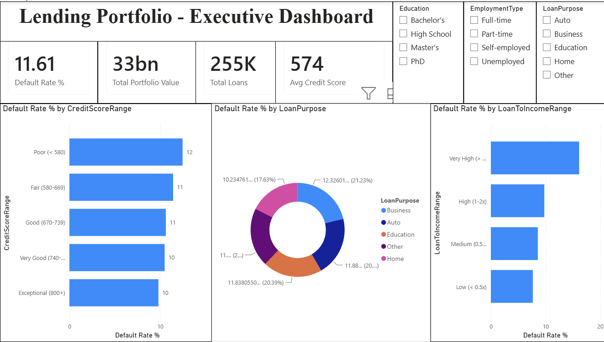

LENDING PORTFOLIO — EXECUTIVE DASHBOARD (Power BI)

Interactive Power BI dashboard built on top of the lending SQL analysis, connecting
live to a MySQL view to surface portfolio-level default risk for executive reporting.

OVERVIEW
- Source: MySQL "lending" database, "loans_enriched" view (built on the raw 255,347-row
  "loans" table, with credit score, DTI, and loan-to-income buckets pre-computed in SQL)
- Connection: Power BI Desktop -> MySQL connector (Import mode)
- Tool: Power BI Desktop, DAX

WHAT'S IN THE DASHBOARD
- KPI Cards: Default Rate %, Total Portfolio Value, Total Loans, Avg Credit Score
- Default Rate % by Credit Score Range — confirms default risk rises as credit score drops
- Default Rate % by Loan Purpose — shows default rate is roughly uniform (~11-21%) across
  purposes, a known limitation of the underlying synthetic dataset
- Default Rate % by Loan-to-Income Range — the standout finding: default rate climbs
  cleanly from ~11% (Low, <0.5x income) to ~19-20% (Very High, >2x income) — a stronger,
  more monotonic signal than credit score banding
- Slicers: Loan Purpose, Employment Type, Education — fully interactive filtering across
  all visuals

KEY BUSINESS INSIGHT
Loan-to-income ratio is a stronger single predictor of default in this portfolio than
credit score range — worth prioritizing in underwriting checks alongside traditional
credit scoring.

WHY A SQL VIEW INSTEAD OF DAX BINNING
All bucket/tier logic (CreditScoreRange, DTIRange, LoanToIncomeRange) was built once as
a MySQL view (loans_enriched) rather than recreated in DAX. This keeps a single source
of truth for business rules — if a threshold changes, it's updated in one place, not
duplicated across SQL and DAX.

DAX MEASURES
Total Loans = COUNTROWS(loans_enriched)
Total Defaults = SUM(loans_enriched[Default])
Default Rate % = DIVIDE([Total Defaults], [Total Loans]) * 100
Total Portfolio Value = SUM(loans_enriched[LoanAmount])
Avg Credit Score = AVERAGE(loans_enriched[CreditScore])

TOOLS
- Power BI Desktop
- MySQL 8.0 (via MySQL Connector/NET)
- DAX

FILES
- lending_kpi_dashboard.pbix — the Power BI file
- learning_material.txt — concept notes for this project
- Dashboard screenshot / exported PDF

RELATED PROJECT
Builds directly on lending-sql-analysis — the SQL exploration this dashboard visualizes.

